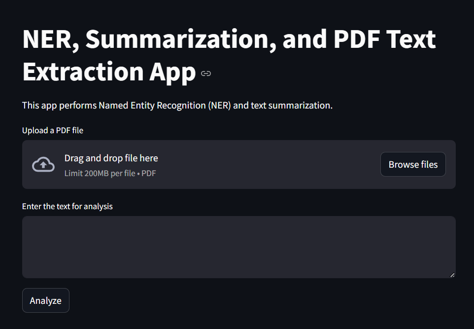

# TextInsight: Named Entity Recognition and Summarization App

**TextInsight** is a powerful web application built with Streamlit that allows you to extract meaningful information from text, such as **Named Entities** and **Summaries**. This app works with both uploaded PDF files and manual text input, providing real-time analysis with state-of-the-art Natural Language Processing (NLP) models.

### Features:
- **Named Entity Recognition (NER)**: Extracts important entities like names, organizations, dates, and more from text.
- **Text Summarization**: Provides concise summaries of long documents or paragraphs.
- **PDF Text Extraction**: Supports extracting text from PDF files for analysis.
- **Downloadable Data**: Extracted entities can be downloaded as a CSV file for further use.

### Technologies Used:
- **Streamlit**: For building the interactive web app.
- **SpaCy**: For Named Entity Recognition.
- **Transformers (Hugging Face)**: For text summarization.
- **PyMuPDF**: For extracting text from PDF files.

---

## Demo

You can view the demo video of how the app works below:


https://github.com/user-attachments/assets/04971534-dba9-4c82-af30-1b06d237c465


Here's a screenshot of the app in action:



---

## How to Run the App on Google Colab

Follow these steps to run the app on Google Colab:

### 1. Open a New Colab Notebook

- Go to [Google Colab](https://colab.research.google.com/), and create a new notebook.

### 2. Install Dependencies

In the first cell of your Colab notebook, run the following commands to install the required dependencies:

```python
!pip install spacy streamlit pandas transformers pyngrok pymupdf
!python -m spacy download en_core_web_sm
```

### 3. Upload Your Files

You can upload your script, demo video (`ner-nlp.mp4`), and screenshot (`demo.png`) to Google Colab.

```python
from google.colab import files
uploaded = files.upload()
```

### 4. Write Your Application Code

Next, copy and paste your **TextInsight** app (app.py) code (the Python script for Streamlit) into a cell in the Colab notebook. The code should be similar to this:

```python
import spacy
import streamlit as st
import pandas as pd
import re
from io import StringIO
from spacy import displacy
import fitz  # PyMuPDF for PDF extraction
from transformers import pipeline

# Load SpaCy model
@st.cache_resource
def load_model():
    nlp = spacy.load("en_core_web_sm")
    return nlp

# Load summarization model
@st.cache_resource
def load_summarizer():
    summarizer = pipeline("summarization")
    return summarizer

# Initialize models
nlp = load_model()
summarizer = load_summarizer()

# Function to extract text from PDF
@st.cache_data
def extract_text_from_pdf(file):
    doc = fitz.open(stream=file.read(), filetype="pdf")
    text = ""
    for page in doc:
        text += page.get_text()
    return text

# Function to convert dataframe to CSV
def convert_df_to_csv(df):
    csv = df.to_csv(index=False)
    return StringIO(csv).getvalue()

# Streamlit app layout
def app():
    st.title("NER, Summarization, and PDF Text Extraction App")
    st.write("This app performs Named Entity Recognition (NER) and text summarization.")

    # File upload
    uploaded_file = st.file_uploader("Upload a PDF file", type=["pdf"])
    text = ""
    if uploaded_file is not None:
        text = extract_text_from_pdf(uploaded_file)
        st.write("Extracted text from the PDF:")
        st.text_area("PDF Text", text, height=300)

    # Manual text input
    else:
        text = st.text_area("Enter the text for analysis")

    # Perform operations when the Analyze button is clicked
    if st.button("Analyze"):
        if text:
            # Summarization
            with st.spinner("Generating summary..."):
                summary = summarizer(text, max_length=130, min_length=30, do_sample=False)[0]['summary_text']
            st.subheader("Text Summary")
            st.write(summary)

            # NER Analysis
            doc = nlp(text)
            entities = [(ent.text, ent.label_) for ent in doc.ents]

            # Entity Categorization
            entity_types = sorted(set([ent[1] for ent in entities]))
            selected_entity_types = st.multiselect(
                "Select entity types to extract", options=entity_types, default=entity_types
            )
            filtered_entities = [ent for ent in entities if ent[1] in selected_entity_types]

            # Display the extracted entities
            if filtered_entities:
                st.subheader("Named Entities")
                df = pd.DataFrame(filtered_entities, columns=["Entity", "Label"])
                st.dataframe(df)

                # Download button for entities
                csv = convert_df_to_csv(df)
                st.download_button("Download Entities as CSV", csv, "entities.csv", "text/csv")
            else:
                st.write("No named entities found for the selected categories.")
        else:
            st.write("Please enter some text or upload a PDF for analysis.")

# Run the Streamlit app
if __name__ == "__main__":
    app()
```

### 5. Run the Streamlit App in Colab

Since Google Colab doesn't natively support running Streamlit, we will use **pyngrok** to create a tunnel for accessing the app in the browser.

First, import and set up **ngrok** for tunneling the app:

```python
from pyngrok import ngrok

# Start Streamlit app in the background
!streamlit run ner_app.py &

# Set up ngrok tunnel
public_url = ngrok.connect(port='8501')
print(f"Streamlit app is live at: {public_url}")
```

This will start the Streamlit app in the background, create a public URL using **ngrok**, and you can view the app by following the provided URL.

---

## How to Use the App

1. **Upload a PDF file**: Click on the "Upload a PDF file" button and choose a file. The app will extract the text and display it in the text box.
   
2. **Enter Text Manually**: You can also type or paste the text you want to analyze into the input box.
   
3. **Analyze**: Click on the "Analyze" button to generate a summary of the text and extract the named entities.
   
4. **Download Results**: The extracted named entities will be displayed in a table. You can download the results as a CSV file for further analysis.

---

## License

This project is open-source and available under the [MIT License](LICENSE).

---

## Contact

For any questions or inquiries, feel free to contact me at 

**YASH GUPTA** - [yashgupta0212@gmail.com](yashgupta0212@gmail.com).
